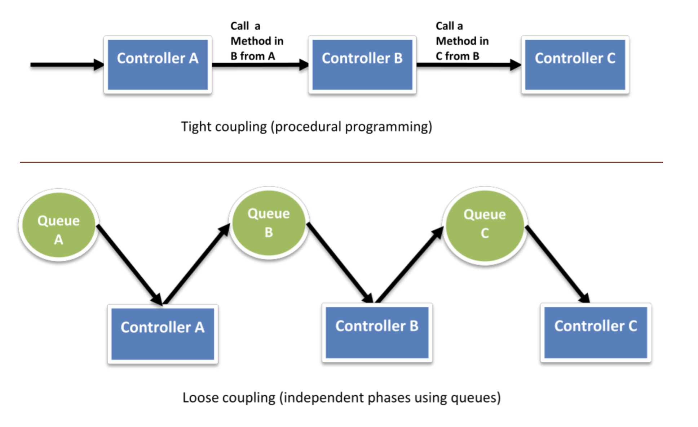
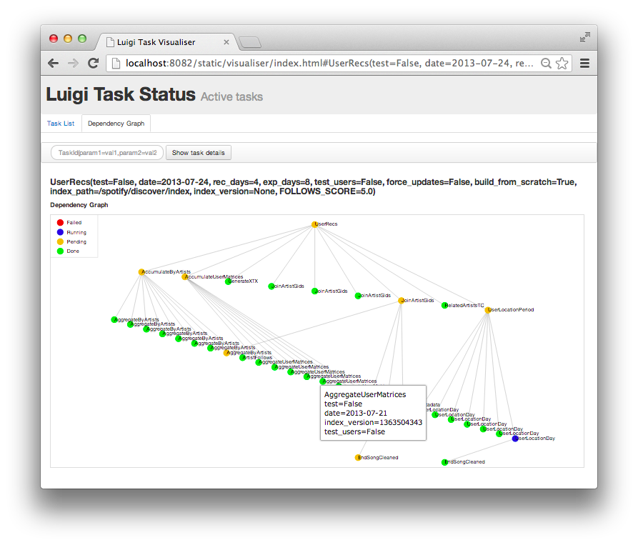
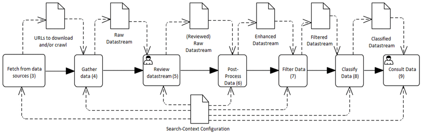

# Workflow Orchestration

A review of approaches to workflow and pipeline management for data science.

- [Workflows & Jobs](#workflows--jobs)
- [Loose Coupling](#loose-coupling)
- [Orchestration Models](#orchestration-models)
- [Considerations](#considerations)

## Workflows & Jobs

Many data science projects involve running data through a multi-series workflow. Let's call
the end-to-end process a "workflow" and each step within it a "job." Jobs should be discrete
tasks specific to a logical step of the entire workflow. Here are some examples of jobs:

- Portions of ETL
- Fetching data from a remote source
- Running a recurring, scheduled task
- Performing analysis or ML models against data
- Ingesting a file
- . . .

Jobs can be standalone scripts, containerized processes with all dependencies bundled, they
can be HPC (SLURM) or Kubernetes jobs, or compiled executables. 

Most jobs require input of some kind, parameters or options configured for their operation, and 
some details for what to output, and where that should go.

- Input file name / path
- Keys / Tokens / Certificates
- Input parameters (`env` vars, configuration files, etc.)
- Output parameters (path, output format, etc.)
- Runtime constraints

## Loose Coupling

The best approach to an effective workflow is to ensure that each step is independent of the 
others, can be debugged or scaled independently from other jobs, and that the developer preserve "loose 
coupling" between them. Which is to say that you should always avoid introducing any tight 
logic from one step to another.

If Process A runs and then forces its output directly to Process B, it is possible that
Process B is still busy with another job, or that it has errors, or otherwise unavailable.



Loose coupling in the context of workflows is an approach that makes use of some external
logic or orchestrator to know the state of all jobs within all workflows, and to help trigger
or queue the flow of work throughout the pipeline. Loose coupling in the context above means that
when Process A completes, it checks in with the workflow orchestrator to indicate the job is
complete, and the orchestrator either (1) prompts Process B to initiate (a PUSH model); 
or (2) queues the job for Process B to pick up (a PULL model) when it is available.

## Orchestration Models

Let's consider three general models for delivering a multi-step workflow on a compute system.


1. **List- or loop-based workflows** - Developers are likely already quite familiar with driving
a repetitive job off of a list of some type. This might be a local text file with a list of IDs,
an API offering lists or items to be processed, or a database table.

    The workflow fetches an ID to work with, and moves the file through each job in the
    workflow, step by step. Once the file is completed, the workflow triggers the next
    file to be processed.

    ```bash
    > 0102AH29
      0914BG32
      0872GC11
      0174EF79
      . . .
    ```

    ```python
    import os
    
    idlist = open("id-file.txt", "r")

    for id in idlist:
      # do something
      # - run job
      # - subit slurm script
      # . . .
    ```

    ```python
    # Or loop through only the first N lines of a file

    for id in (idlist[:N]):
      # do something
      # - run job
      # - submit slurm script
      # . . .    
    ```

    An advantage of this model is simplicity and maintenance. It allows one primary script (or SLURM job, etc.)
    to trigger multiple jobs, and for them all to share state within a single environment. (`env` variables,
    for instance, can be written to / read from the instance hosting the workflow.

    A disadvantage of this model is slow throughput, and the inability to run parallel work at the same time unless the loop is submitting a swarm of requests to a job scheduler (SLURM, Kubernetes).

2. **Workflow managers** - Many solutions to workflow/pipeline management have been created,
of varying qualities and with specific verticals or audiences in mind. Generally they
help the developer define, author, manage, and maintain workflows of varying complexity,
with varying levels of logic (if-then conditionals, error handling, etc.)

    Note that a robust workflow manager should be able to take advantage of a breadth of compute platforms and options: bare metal servers, containers, cloud services, HPC jobs, Kubernetes jobs, and so forth. A weak solution would require ALL jobs (i.e. all steps of a workflow) to match in form.

    Some noteworthy solutions are:

      A. **Luigi**, created by Spotify, is a Python-based manager for coordinating tasks within longer running workflows. It "handles dependency resolution, workflow management, visualization, handling failures, command-line integration, and much more. [Read more](https://luigi.readthedocs.io/en/stable/)

    

      B. **Apache Airflow**, first authored by AirBnb and open-sourced in 2016, is written in Python and can handle a variety of tasks, logic, and complexity. [Read more](https://airflow.apache.org/)

    

      C. **Cromwell**, created by the Broad Institute, is a "scientific workflow engine designed for simplicity and scalability." Cromwell enables jobs to be run on a variety of platforms (on-premise, cloud, HPC, etc.) within the same workflow. [Read more](https://github.com/broadinstitute/cromwell)

    

      D. **maestrowf**, sponsored by the Lawrence Livermore NL, is Python-based, installable as a `pip` package, and configured using readable YAML files. [Read more](https://github.com/LLNL/maestrowf)

    

    A well-curated list of many other pipeline management tools is [available here](https://github.com/pditommaso/awesome-pipeline)

3. **Event-driven microservices** - This solution tends to be more "cloud native," in that it is built with managed services in public cloud providers such as AWS, GCP, and Azure. Event-driven computing in AWS centers on either Lambda functions (triggered by one another using decoupled SQS queues, etc.) or Step Functions, which is a logical framework for executing Lambda functions and other software for more elaborate scenarios.

    

    Alternatively, this solution could be built by containerizing the job steps and deploying into a container orchestrator such as Kubernetes. However, while this provides an environment in which to host the containers, the developer still needs a workflow/pipeline manager of some sort to queue any data or file processing to occur, moving each data blob through the pipeline.

## Considerations

Several factors should be taken into consideration when selecting or designing a workflow 
solution. These include:

- **Complexity** - Does the solution offer enough complexity and options for your work? Too many?
- **Ease of deployment** - How challenging is the deploymet of the solution, and what is required to launch and run it?
- **Ease of management** - How much time and what skills are required to maintain and manage the solution?
- **Error/Exception Handling** - How does the solution handle errors, and does it provide options to roll-back or repeat failed jobs?
- **Throughput / ability to run jobs in parallel** - Does the solution provide ample throughput and the ability to process many things at once, or is it more limited?
- **Platform requirements** (GPUs, databases, etc.) - Does the solution require special services or ancillary platforms in order to run?
